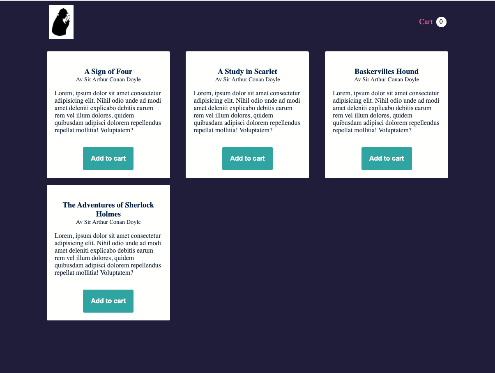

# Props

## Övning 1: Bookstore - Veckans Code Review-uppgift

I denna övning skall du försöka återskapa designen som du kan se på bilden nedan. Sidan kommer i detta steg vara statisk, dvs. du kommer att hårdkoda in mycket av informationen, och sidan kommer inte att vara interaktiv. Vi kommer återvända och lösa dessa delar kommande veckor.

Följande komponenter bör finnas med:

- App
- Header
- Cart (indikatorn som ligger i Header)
- BookPage (kommande veckor kommer vi lägga till fler sidor)
- BookList (valfri, ni kan också lägga era böcker rakt i BookPage)
- Book

Använd er av filen `books.json` i mappen `assets` för data till era objekt. Välj själva vilka delar av objekten ni vill rendera ut. Skissen behöver naturligtvis inte följas, den är bara ett förslag. Logotypen i bilden finns inte, så den kan ni ersätta med valfri bild/rubrik.

### Skiss

## Övning 2: Valfritt projekt

Skapa en valfri, egen applikation som använder sig av props. Det ligger .json-filer i assets med en massa material ni kan använda er utav.
